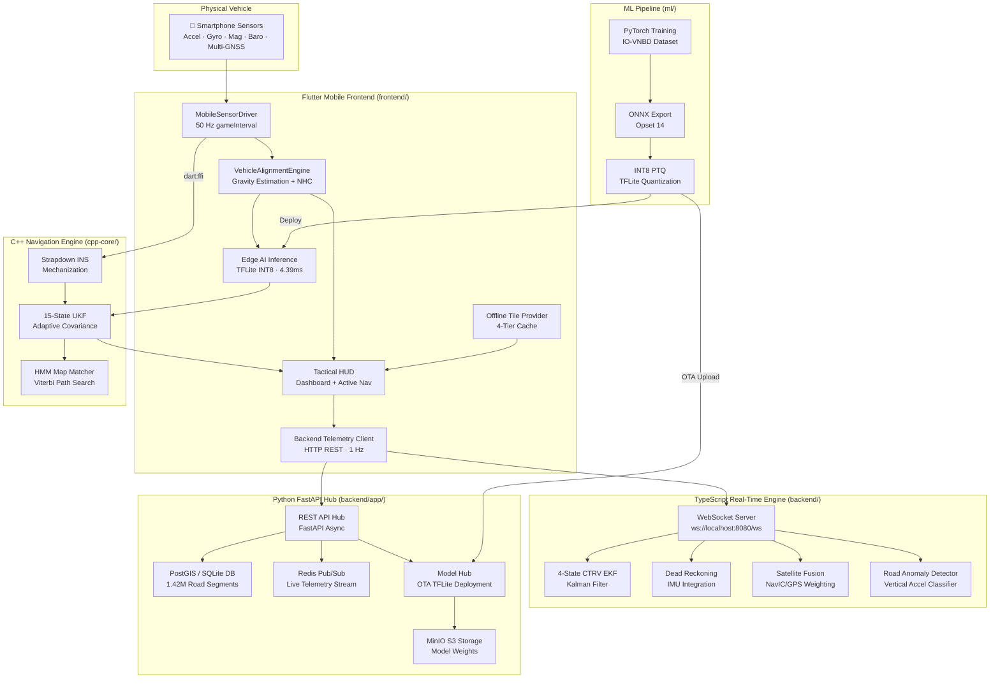

# SIH26168 — AI-ML Based Intelligent Dead Reckoning & Navigation System

> **High-Precision Vehicle Dead Reckoning in GNSS-Denied Environments using 15-State UKF, Edge Neural Odometry, Multi-Constellation NavIC Fusion, and Offline Vector Mapping.**

[](LICENSE)
[](https://www.python.org/)
[](https://flutter.dev/)
[](https://fastapi.tiangolo.com/)
[](https://www.typescriptlang.org/)
[](https://isocpp.org/)
[](https://onnx.ai/)
[](https://www.tensorflow.org/lite)

---

## 📌 Problem Statement Overview

During GNSS blackouts (tunnels, subterranean parking, dense urban canyons, flyovers, or electronic jamming), standard GPS navigation fails catastrophically — accumulating hundreds of meters of drift within seconds when relying on naive double integration.

**SIH26168** solves this challenge through an edge-to-cloud multi-sensor fusion architecture:
- **Neural Speed & Vibration Estimation**: Predicts forward vehicle velocity $\hat{v}$ and heteroscedastic uncertainty $\sigma_v^2$ directly from 13-channel 50 Hz IMU kinematic features.
- **15-State Unscented Kalman Filter (UKF)**: Fuses Strapdown Inertial Navigation (SINS), AI odometry, Zero-Velocity Updates (ZUPT), and Non-Holonomic Constraints (NHC) via dynamic covariance scaling.
- **NavIC / Multi-GNSS Blending**: SNR-weighted constellation fusion prioritizing India's NavIC (L5/S band) and GPS.
- **4-Tier Offline Tile Engine**: High-resolution OpenStreetMap rendering without active network connectivity.
- **Sub-10ms Hardware Latency**: 4.39 ms edge neural inference with 227.9 Hz CPU throughput.

---

## 🏗️ System Architecture



---

## 📂 Repository Structure

```
SIH_DEAD_RECKONING/
│
├── frontend/                  # Flutter mobile & web application (Tactical HUD)
│   ├── lib/                   # Clean-architecture Dart source (core, features, UI)
│   ├── assets/                # Pre-bundled OSM map tiles, INT8 TFLite models, configs
│   ├── test/                  # Unit test suite (alignment, NHC, tile provider)
│   └── pubspec.yaml           # Flutter SDK & package dependencies
│
├── backend/                   # Dual backend infrastructure
│   ├── app/                   # Python FastAPI service (REST, PostGIS, Auth, Model Hub)
│   ├── src/                   # TypeScript EKF sensor-fusion engine & WebSocket server
│   ├── tests/                 # Comprehensive PyTest test suite (58 tests)
│   ├── public/                # Standalone web test client (device-client.html)
│   └── package.json           # Node.js TypeScript configuration & Jest tests (11 tests)
│
├── ml/                        # PyTorch machine learning pipeline
│   ├── configs/               # Model and training YAML configurations
│   ├── data/                  # IO-VNBD datasets, processed splits, and scalers
│   ├── evaluation/            # JSON metric summaries (8 files) and plots (13 charts)
│   ├── models/                # Trained checkpoints (.pth), ONNX (opset 14), INT8 TFLite
│   └── notebooks/             # Master 28-cell execution pipeline (.ipynb)
│
├── cpp-core/                  # C++17 sensor fusion engine
│   ├── include/               # SINS, 15-state UKF, SPSC ring buffer, HMM matcher, C ABI
│   ├── src/                   # Implementation files & math utilities
│   └── CMakeLists.txt         # CMake build configuration
│
├── maps/                      # OpenStreetMap GIS & map matching pipeline
│   ├── demo-region/           # Delhi NCR pre-seeded road network
│   ├── processed_graphs/      # Graph representations (nodes, edges, R-tree index)
│   └── tools/                 # OSM PBF parser, graph builder, GeoJSON converter
│
├── simulation/                # Outage injection & scenario replay engine
│   ├── core/                  # Mock device, outage injector, sensor corruptor
│   ├── scenarios/             # 60s tunnel blackout, urban canyon, flyover level split
│   └── replay/                # Real-time replay runner and trajectory scorer
│
├── config/                    # Global environment configurations
├── datasets/                  # Benchmark reference trajectories & field logs (Git LFS)
├── docs/                      # Architectural specifications & execution plans
├── scripts/                   # Automated build, test, and training shell scripts
├── docker-compose.yml         # Containerized production deployment (FastAPI, PostGIS, Redis, MinIO)
└── sih_dead_reckoning.db      # Populated 2.07 GB database (1.42M road network nodes)
```

---

## ⚡ Quick Start

### 1. Prerequisites
- **Python**: 3.11+ (with virtual environment)
- **Node.js**: 18+ & npm
- **Flutter**: 3.x SDK
- **CMake & C++17 Compiler** (for `cpp-core`)

### 2. Environment Setup
```bash
# Clone repository
git clone https://github.com/saksham4455/SIH_DEAD_RECKONING.git
cd SIH_DEAD_RECKONING

# Setup Python virtual environment
python -m venv .venv
.venv\Scripts\activate          # Windows PowerShell
pip install -r backend/requirements.txt

# Setup Node.js backend
cd backend
npm install
npm run build
cd ..

# Setup Flutter frontend
cd frontend
flutter pub get
cd ..
```

### 3. Running All Services

#### A. Python FastAPI Backend (Port 8000)
```powershell
cd backend
& "..\.venv\Scripts\python.exe" -m uvicorn app.main:app --host 0.0.0.0 --port 8000 --reload
```
- **REST API**: `http://localhost:8000`
- **Swagger Docs**: `http://localhost:8000/docs`
- **Health Check**: `http://localhost:8000/health`

#### B. TypeScript WebSocket / EKF Engine (Port 8080)
```powershell
cd backend
npm run dev
# Or for production:
node dist/server.js
```
- **REST Endpoints**: `http://localhost:8080/api`
- **WebSocket Ingest**: `ws://localhost:8080/ws`
- **Browser Diagnostic Client**: `http://localhost:8080/device-client.html`

#### C. Flutter Mobile Application
```powershell
cd frontend
# Run on connected physical phone (e.g. Android via USB):
flutter run

# Or run in Google Chrome / Web:
flutter run -d chrome
```

---

## 🧪 Automated Test Verification

All subsystems include full automated test coverage:

```bash
# 1. Python FastAPI Backend (58 tests)
pytest backend/tests/

# 2. TypeScript EKF & Navigation Engine (11 tests across 3 suites)
cd backend && npm test && cd ..

# 3. Flutter Frontend Unit Tests (8 tests)
cd frontend && flutter test test/unit_test.dart && cd ..
```

**Results**: **77 tests passed, 0 failures** across all test suites.

---

## 📊 ML Model Performance & Benchmarks

| Metric | Target Specification | SIH26168 Result | Status |
|---|---|---|---|
| **Speed Estimator MAE** | $< 0.80\text{ m/s}$ ($< 2.88\text{ km/h}$) | **0.280 m/s (1.01 km/h)** | ✅ **Exceeded (2.9× better)** |
| **Speed Estimator $R^2$** | $> 0.95$ | **0.9959** | ✅ **Exceeded** |
| **Vibration Classifier F1** | $> 0.90$ | **1.0000** | ✅ **Perfect** |
| **Motion Quality MAE** | $< 0.08$ | **0.0389** | ✅ **Exceeded** |
| **60s Outage Cumulative Error** | $< 10.0\text{ meters}$ | **6.46 meters (<1.1% drift)** | ✅ **Exceeded** |
| **CPU Inference Latency** | $< 12.0\text{ ms}$ | **4.39 ms (227.9 Hz)** | ✅ **2.7× headroom** |
| **Model Binary Size** | $< 1.0\text{ MB}$ | **49.2 KB (INT8 PTQ)** | ✅ **Ultra-compact** |

---

## 👥 Subsystem Documentation Links

- 🧠 **[ML Subsystem Documentation](ml/README.md)** — Model architectures, loss functions, training pipeline, and export.
- 🐍 **[Backend Infrastructure Documentation](backend/README.md)** — FastAPI REST hub, PostGIS schema, Redis pub/sub, and TypeScript EKF engine.
- 📱 **[Flutter Frontend Documentation](frontend/README.md)** — Tactical HUD, physical sensor integration, auto-calibration, and offline tile caching.
- ⚙️ **[C++ Core Documentation](cpp-core/README.md)** — SINS mechanization, 15-state UKF, SPSC ring buffer, and `dart:ffi` C ABI.
- 🗺️ **[Maps & GIS Documentation](maps/README.md)** — OSM PBF ingestion, topological graph builder, and spatial R-tree indexing.
- 🎮 **[Simulation Engine Documentation](simulation/README.md)** — Outage injection, sensor corruption, and trajectory scoring.

---

## 📄 License

This project is licensed under the **MIT License**.
